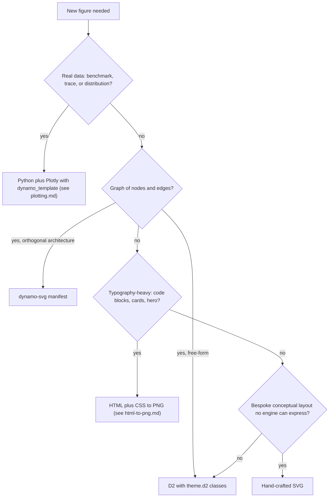

# Blog Figures

The North Star is three words: **beautiful, elegant, thoughtful**. A figure that fails any one of those gets cut, not shipped. Beauty comes from craft (palette, typography, geometry). Elegance comes from data-ink discipline (every mark earns its place). Thoughtfulness comes from picking the right pathway and stating one clear takeaway.

The five pathways are not interchangeable. Each one wins on a specific shape of problem and loses on others. Picking wrong is the most common way to ship a mediocre figure.

## Pathway Decision Matrix



### Wins-When / Loses-When

| Pathway | Wins when | Loses when |
|---|---|---|
| Python + Plotly | Real benchmark or trace data, log axes, peak-value annotations, before/after performance comparisons | Conceptual layouts, typography-heavy hero images, freeform diagrams |
| D2 | Graphs of nodes and edges (event flows, request paths, fan-in/fan-out), small-to-medium architecture diagrams, anything that benefits from auto-layout | Layouts where every mm matters, before/after side-by-side comparisons, typography-heavy figures |
| dynamo-svg manifest | Orthogonal multi-zone architecture diagrams, scored geometry, repeat usage of the same component grammar across blogs | One-off conceptual shapes, freeform graphs, charts |
| Hand-crafted SVG | Bespoke conceptual shapes (custom dividers, three-column annotated tables, gates, layered protocol stacks), pixel-precise control | Anything an engine could lay out for you (use D2 or dynamo-svg first) |
| HTML + CSS to PNG | Code-with-callouts, comparison cards, hero images with hierarchical type, "card stack" mocks where CSS is the most expressive layout engine | Precise vector geometry, data-bound charts, anything that needs SVG paths or filters |

### Pathway Tie-Breakers

- "I have CSV/JSON of real numbers" → Python every time. Even if the chart is small, the data deserves the audit trail of a script.
- "It's a graph and I don't know if it's free-form or orthogonal" → start with D2. Promote to dynamo-svg if the graph repeats across multiple blogs.
- "It's typography-heavy AND has SVG geometry" → hand-craft the SVG. HTML→PNG cannot do precise vector paths.
- "I'm tempted to copy-paste a Figma or Keynote export" → don't. The result will not match the design system and will not be reproducible.

## Mandatory Render-and-Critique Loop

After **every** render (not just the first one), walk this loop out loud in chat. No silent "looks fine".

1. **View the PNG.** For SVG-only outputs, also render to PNG at 2x via `rsvg-convert -z 2`.
2. **State the single takeaway** in one declarative sentence. If you cannot, the figure has no reason to exist.
3. **Walk the seven non-negotiables** (next section). Name any that fail.
4. **Walk the relevant anti-pattern bank.** Use [aesthetic.md](aesthetic.md) for diagrams. Use [plotting.md](plotting.md) for charts.
5. **List the next two improvements** if any non-negotiable or anti-pattern failed. Re-render. Loop.

Only when (a) the takeaway sentence holds, (b) the seven non-negotiables pass, and (c) no anti-pattern is present, may you claim done.

This loop is deliberately slow. The polished hand-tuned feel of the corpus comes from this discipline, not from clever tools.

## The Seven Non-Negotiables (Dynamo Dark Aesthetic Ladder)

1. **Pure black background.** `#0a0a0a` or `#000000`. Never transparent. Never `#111111` "soft black" — readers' monitors lie.
2. **Rectangular shapes only.** `border-radius: 0` everywhere. No rounded corners. Ever.
3. **Muted fills at `opacity: 0.75`.** Never solid saturated fills.
4. **Selective accent.** Dynamo green (`#76b900`) only for the single primary item in a figure. Never for everything. If everything is green, nothing is green.
5. **Typography pair from one family.** Two families maximum: a body sans + an aligned mono. Pick the family per blog (see below) and hold the line — never mix flash-indexer Arial with mocker Geist inside one blog.
6. **One headline style per family.**
   - **flash-indexer family** (compact data-dashboard scale): 18 px ALL-CAPS letter-spaced title, `text-transform: uppercase`, `letter-spacing: 0.08em`. Body in `'NVIDIA Sans', Arial, Helvetica, sans-serif`. Mono in `'Roboto Mono', 'SF Mono', Menlo, Consolas, monospace`.
   - **Digital Twin family** (display-scale headline figures; also called DynoSim): 42 px **Helvetica Neue Light** title, weight 300, sentence-case, top-left of canvas. 22 px subtitle in `#767676` with em-dash + descriptive-clause + takeaway clause. Body in `Geist, Inter, 'Helvetica Neue', Arial, sans-serif`. Mono in `'Geist Mono', 'JetBrains Mono', 'Roboto Mono', 'SF Mono', Menlo, Consolas, monospace`. Every text element is `font-weight: 300` unless it's a callout-card label.
7. **1px subtle borders.** Never 2px or thicker except for emphasis on the single accent item, and never on container frames.

If you find yourself writing "well, this figure is special" — you're wrong. The non-negotiables are non-negotiable. Find a way to express what you need within them.

### Picking the Family

| Use the **flash-indexer** family when... | Use the **Digital Twin** family when (default for new Dynamo blogs)... |
|---|---|
| The figure is a chart with many marks, dense ticks, or a heatmap | The figure is a hero, headline, or anchors a section |
| Multiple series demand the compact 10-12 px labels | The takeaway compresses into one descriptive sentence |
| Embedded inline with body prose at column width | Embedded as a standalone artifact at full page width |

Within one blog, every figure uses the same family. Cross-family blogs read as two unrelated projects stapled together.

**Find the canonical reference before drafting.** Don't guess what a family looks like from the name. Locate an existing exemplar SVG from a prior blog in the same family (the team maintains canonical sets — ask if you're not sure where they live), open it, and read the actual `<style>` block — font sizes, weights, exact color hex codes, title placement. Five minutes of looking saves five render-and-iterate cycles of getting it wrong.

Full palette, typography, and component spec: [DESIGN.md](DESIGN.md). Use this file as the cite-able source of truth — automated audits and other agents quote it verbatim. Extended chart and diagram notes live in [aesthetic.md](aesthetic.md).

## Anchor in Real Data — Never Invent Numbers

If a figure labels memory sizes, latency numbers, throughput figures, or any other measurement, those numbers must come from the source of truth — the blog body prose, a TSV/JSON in the blog's `data/` directory, a benchmark log, or measured values the user has stated in the conversation. Made-up numbers do not survive review by anyone who knows the system. They will be caught, and unwinding them costs more than the time saved by inventing them.

If you don't have the real value:

- **Use a generic label** (`Weights · model parameters` rather than `Weights · ~26 GiB`).
- **Ask the user for the number** before adding it to the figure.
- **Read the source of truth** — open the blog markdown, the data file, the benchmark TSV.

Plausible-sounding fabrications read as authoritative until a reviewer who knows the system sees them — and then everything in the figure is suspect, not just the wrong number. This is a non-negotiable on the same level as the seven core ones, but explicit because it's a failure mode that's seductive: the figure renders, the layout looks fine, and you only find out it's wrong when somebody who knows the system reads it.

## Multi-Figure Family Discipline

A real blog post has 6–12 figures. The 7 non-negotiables guarantee any single figure looks right. They do not guarantee the *set* of figures looks like one coherent thing. For a multi-figure blog, hold an extra layer of discipline:

**One placement rule per visual category, applied to every figure in the set.** Don't mix conventions across the set, even if each individual chart "works" with its local choice.

| Visual element | Pick one rule, apply across the family |
|---|---|
| Bar value labels (segment durations, bar magnitudes) | Always inside the bar, centered, drop if bar is too small to fit. Do *not* mix inside-some, outside-others, above-some. |
| Lane totals (sum of a Gantt row, summary value for a group) | Always outside the lane to the right, in mono. This is a separate visual category from bar values — its own consistent placement. |
| Overflow values (bar extends past the axis) | Chevron + mono label outside the axis on the right, with an optional italic sub-line for context. Separate visual category from bar values. |
| Legends | Bottom-center of canvas, swatches + sans labels. One row if it fits; two centered rows if it doesn't. |
| Title position | Top-left at fixed `x` (tightly into the corner — `x=40` for 1280-wide canvases, `x=50` for 1600-wide) — never centered, never floating. |
| Canvas widths | Body figures: 1280 px. Hero / standalone figures: 1600 px. Don't deviate per figure. |
| Card surfaces | `#0f0f0f` fill, `#2a2a2a` 1 px hairline border. The single accent (green) item gets `#74b711` 1.5–2 px border or a subtle green-tint interior — never both at once. |

If you find yourself making a different choice for one figure in the set, stop and ask whether the whole set should change to match — or whether that one figure should change back to match the set. The set decides; one figure does not get a special exception.

## Before / After Structural Honesty

When a figure compares a pre-state to a post-state (`Before / After`, `Without / With`, `Serial / Parallel`), the structural shape of the BEFORE panel must accurately represent the pre-state — not be a degraded copy of the AFTER panel with one element dimmed or one cell highlighted.

The fix is to draw, in BEFORE, only what actually exists at that point in the system's life. In AFTER, draw the new machinery the change introduces. The structural difference between the two panels *is the content* of the comparison; if BEFORE just looks like a faded AFTER, the figure has nothing to say.

A reader who knows the underlying system will spot a structurally-wrong BEFORE immediately and conclude the figure doesn't understand its own subject. That doubt then poisons the rest of the figure even if the AFTER panel is correct.

## Geometry Precision

Free-form positioning is where hand-drawn SVGs fail. Cards drift a few pixels from the column they should be in, arrow tips float in white space between cards, "right-aligned" columns of values actually span 100 pixels horizontally because each one is positioned relative to whatever's to its left.

The fix is to **compute, don't eyeball**. Every important coordinate should derive from named constants or from another element's known coordinate — not from a number you picked because the render looked OK.

Five rules, in order of how often they fail:

1. **Arrow endpoints land on exact card edges.** When an arrow connects card A to card B horizontally, the tail starts at `A.x + A.width` and the tip lands at `B.x` (minus arrowhead length). Don't draw the arrow first and place the cards around it. Compute card geometry first, derive arrow geometry from it.

2. **Right-aligned columns share one anchor x.** When a column of values appears at the end of multiple rows (lane totals on a Gantt, speedup callouts, "→ +12 GiB" outcomes), compute one anchor `x = canvas.width - right_margin` once and align all values to it. Never position each row's value relative to where that row's content ends — that produces ragged columns at different x positions even though each one individually "looks right."

3. **Orthogonal-only when paths cross.** For multi-source / multi-target connections (fan-in, fan-out, request-to-worker routing), use only horizontal and vertical segments. Compute the shared meeting line explicitly (e.g., `meet_x = (sources_right + targets_left) / 2`). Diagonal arrows in dense layouts produce the "lines all wrong" look — they appear to cross randomly even when topologically correct.

4. **Center-alignment is computed, not eyeballed.** When centering an element inside a container, use `cx = container.x + container.width / 2` and `text-anchor="middle"`. Same for legend rows: compute the total legend width as the sum of swatches + labels + gaps, then place at `(canvas.width - total_legend_width) / 2`. Eyeballed legends drift ~10-20 px off center, and the drift is visible at a glance even if you can't immediately name it.

5. **Prefer a grid layout over free-form positioning.** When a figure has cards with connections, ask first: "can I express this as columns × rows?" Eval cases that succeeded in past iterations were grid-shaped (3 columns × N rows). Eval cases that failed were star-shaped (N sources → hub → M targets) and lost on arrow routing. If you find yourself drawing curved or bent connection lines, stop and try refactoring the layout into a grid where connections are straight column-to-column. Even a star-shaped *concept* often renders cleanly as a 3-column grid (sources | hub | targets) with straight horizontal arrows between adjacent columns.

When you can't grid-shape the layout (a true network or DAG), spawn the `create-d2-diagram` or `dynamo-svg` skill instead of hand-crafting the SVG. Auto-layout engines are precisely the tool for this case.

## Common Failure Modes

The render-and-critique loop catches most issues. These six come up often enough across blogs to deserve naming explicitly — walk this list once before declaring a figure done:

1. **Made-up numbers.** See "Anchor in Real Data." Memory sizes, latency numbers, throughput figures, percentages — every digit must come from a source of truth.
2. **Wrong canonical reference.** Family name guessing without opening an actual exemplar SVG. The cost of guessing is 5+ render iterations vs. 5 minutes of reading one canonical file.
3. **Conceptually-wrong before/after.** See "Before / After Structural Honesty." BEFORE must not contain AFTER's machinery.
4. **Inconsistent bar-label placement across the family.** Each chart in isolation looks fine; viewed together they read as different products. See "Multi-Figure Family Discipline."
5. **Tiny noise-bar artifacts.** Sub-threshold phases (durations < 2% of axis range) rendered as 1–2 px slivers that look like rendering bugs. Either drop them entirely, or force a meaningful minimum width with a label.
6. **Arrows not landing on exact card edges.** Arrow tails and tips floating in white space between cards rather than starting at the right edge of card A and ending at the left edge of card B. Geometry should be precise; eyeballed positioning shows. See "Geometry Precision" above for the full rule.
7. **Right-aligned columns at ragged x positions.** Lane totals, speedup callouts, or "outcome" values that should form a vertical column but each sit at a different x (because each was positioned relative to where its row ended). Compute one anchor x; align all values to it.
8. **Star-shaped layouts hand-drawn with bent arrows.** When a figure has many sources connecting to a hub or many targets, drawing the connections by hand produces "lines all wrong" failures. Refactor to a 3-column grid (sources | hub | targets) with straight arrows, or use D2 / dynamo-svg.

## Per-Blog File Layout

Every blog post that needs figures gets the same directory shape:

```
docs/blogs/<slug>/
├── README.md                    # The blog post itself
├── tools/
│   ├── README.md                # Figure inventory + reproduction commands
│   ├── build.sh                 # One-shot rebuild for all figures
│   ├── design_tokens.yaml       # COPIED from canonical (do not fork)
│   ├── plotly_dynamo.py         # COPIED from canonical
│   ├── theme.d2                 # COPIED from canonical
│   ├── inject_legends.py        # Optional: SVG post-processor
│   ├── gen_*.py                 # Python+Plotly figure generators
│   ├── *.d2                     # D2 source files
│   ├── *.svg                    # Hand-crafted SVG sources
│   └── *.html                   # HTML→PNG sources (with sibling .png in images/)
├── images/
│   ├── fig-1-<kebab-name>.svg
│   ├── fig-1-<kebab-name>.png   # 2x render of the SVG, or scale=3 from Plotly
│   ├── fig-2-<kebab-name>.svg
│   └── ...
└── data/                        # Optional: input JSON/CSV used by gen_*.py
    └── *.json
```

**Naming.** `fig-N-<kebab-name>.{svg,png}`. Number from 1 in reading order. The kebab-name is short (3-5 words) and describes the *thing* not the *takeaway*. The figure caption in prose carries the takeaway.

**SVG and PNG always exist as a pair.** The SVG is the source for vector embedding (Fern, Confluence). The PNG is the source for previews and Slack.

## Build Pipeline Contract

Every blog with figures has two required files in `tools/`:

- `build.sh` — one-shot rebuild that produces every figure from sources. Re-runnable without args. `--d2` flag to also re-render D2 sources first.
- `README.md` — figure inventory table (file → description), prerequisites (rsvg-convert, plotly, kaleido, pyyaml, d2), and per-figure reproduction commands.

**Render conventions:**

- Source SVGs render to 2x PNG via `rsvg-convert -z 2 source.svg -o image.png`.
- Plotly figures write SVG and PNG directly with `fig.write_image(svg)` and `fig.write_image(png, scale=3)`.
- D2 sources render with `d2 --layout tala` (or `--layout elk` for tree-shaped layouts) to a `*-raw.svg`, then post-process with a `*.py` injector.
- HTML sources render via Playwright to PNG; the HTML stays in `tools/`, the PNG lands in `images/`. See [html-to-png.md](html-to-png.md).

**The build must be reproducible from a fresh clone.** If you cannot rebuild every figure with `cd tools && ./build.sh`, the blog is broken.

## Bootstrapping a New Blog

When starting figures for a new blog post `docs/blogs/<slug>/`:

```bash
cd docs/blogs/<slug>
mkdir -p tools images data
cd tools

# Copy the canonical design system from a reference blog. Do NOT modify these files in your blog.
cp ../../<reference-blog>/tools/design_tokens.yaml .
cp ../../<reference-blog>/tools/plotly_dynamo.py .
cp ../../<reference-blog>/tools/theme.d2 .

# Stub the inventory and build script.
touch README.md
cat > build.sh <<'EOF'
#!/usr/bin/env bash
set -euo pipefail
cd "$(dirname "$0")"
IMAGES=../images

# Add per-figure render commands as figures are added.
EOF
chmod +x build.sh
```

Why copy and not symlink: each blog gets its own snapshot at the moment it was written, so old blogs keep rendering even if the canonical tokens change.

Why not edit the copies: drift kills the system. If the design tokens need to change, change them in the canonical reference blog and re-copy into new blogs. Never fork.

## Post-Processing Reproducibility Rule

Re-rendering D2 overwrites the raw SVG. So any annotation D2 cannot express — legends, curly braces, coordinate transforms, group labels — lives in a separate Python script.

**The rule:** never edit the final SVG by hand. If a figure needs a custom legend or pixel-precise annotation, write a `postprocess_<name>.py` or `inject_legends.py` script that:

1. Reads the raw SVG from D2.
2. Inserts annotations between `<!-- INJ:legend -->` and `<!-- INJ:legend-end -->` markers (or appends them in known SVG groups).
3. Writes the final SVG to `../images/`.
4. Is idempotent: re-running it on its own output produces the same file.

A working example of this pattern lives alongside each canonical reference blog's `tools/` directory (look for `inject_legends.py` or `postprocess_*.py`).

If you find yourself opening the SVG in Inkscape or hand-editing XML, stop and write the script instead. Hand-edits do not survive the next D2 render.

## Tufte Minimums

These apply to every figure regardless of pathway:

- No 3D, no chart borders, no heavy gridlines, no drop shadows, no gradient fills (the only allowed gradient is the green glow on a single accent element).
- Direct-label over legend whenever ≤ 5 series. Legends only when 6+ series force it.
- Erase redundant ink. If two marks carry the same information, kill one.
- Title carries the takeaway. "Concurrent Indexer Wins by 40x", not "Performance Overview".

Full chart-specific Tufte rules in [plotting.md](plotting.md). Full diagram-specific rules in [aesthetic.md](aesthetic.md).

## Cross-References

Sister files in this skill:

- [DESIGN.md](DESIGN.md) — canonical source of truth for palette, typography, layout, component spec, and forbidden anti-patterns. Cite-able by automated audits.
- [aesthetic.md](aesthetic.md) — extended notes on diagram conventions, D2 class catalog, semantic color map.
- [plotting.md](plotting.md) — chart craft: sparse round-number ticks, axis hygiene, direct labeling, sorting, annotations, chart anti-pattern bank.
- [html-to-png.md](html-to-png.md) — worked recipe with `figure.html` template, Playwright snippet, Satori alternative.

Existing sibling skills to use, not re-implement:

- `create-d2-diagram` — D2 syntax, layout engines (tala vs elk vs dagre), conversion from Mermaid.
- `dynamo-svg` — orthogonal architecture from YAML manifests, design quality scoring.
- `edit-svg` — iterative SVG editing with PNG render feedback after each change.
- `svg` — general SVG creation, optimization, transformation.
- `frontend-design` — HTML/CSS craft (loose adaptation when authoring HTML→PNG sources).
- `parallel-agent-audit` and `plan-to-autorun` — when iterating on 4+ figures simultaneously, use the worktree-per-figure pattern (one git worktree + `.venv` per figure script) so renders run in parallel and edits to one figure can't break the others.

Canonical design system source: each reference blog under `docs/blogs/` ships its own `tools/design_tokens.yaml`, `plotly_dynamo.py`, and `theme.d2`. Start from the most recent blog in the family you're targeting.

## Self-Check Before Declaring Done

A figure is not done until all six items pass. Walk them in this order; do not skip.

- [ ] **Renders cleanly at 2x.** PNG opens without artifacts at `rsvg-convert -z 2` (for SVG sources) or `scale=3` (for Plotly).
- [ ] **Both SVG and PNG exist** in `images/`, named `fig-N-<kebab-name>.{svg,png}`.
- [ ] **Listed in `tools/README.md`** with a one-line description in the figure inventory table.
- [ ] **`build.sh` reproduces it.** Run it from a fresh shell; the figure regenerates byte-for-byte (or close to it).
- [ ] **Passes the seven non-negotiables.** Walked explicitly, item by item, in the chat.
- [ ] **Single takeaway stated** in one declarative sentence. The agent has typed it out, not just thought it.

Only then ship.

## What This Skill Will Not Do

- Will not bundle copies of `design_tokens.yaml`, `plotly_dynamo.py`, or `theme.d2`. Always copy from canonical at render time. Bundling them here would create silent drift.
- Will not duplicate D2 syntax, dynamo-svg manifest schema, or SVG iteration loops. Those live in their own skills above.
- Will not let you skip the render-and-critique loop. The loop is the whole reason figures end up beautiful.
